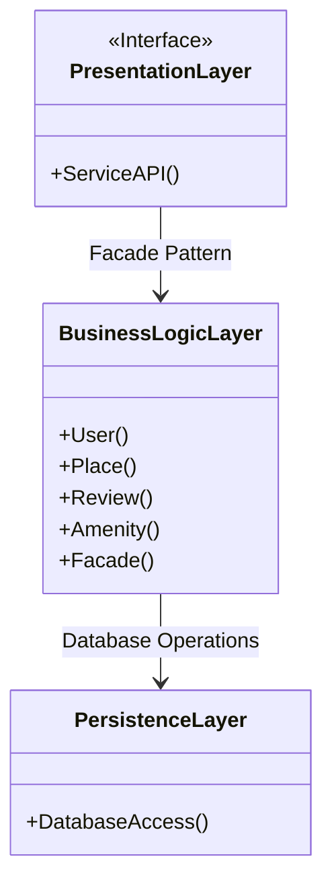
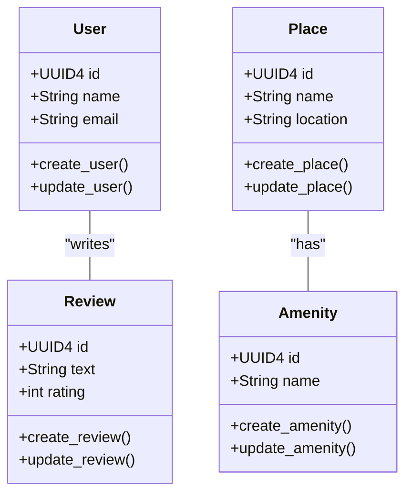
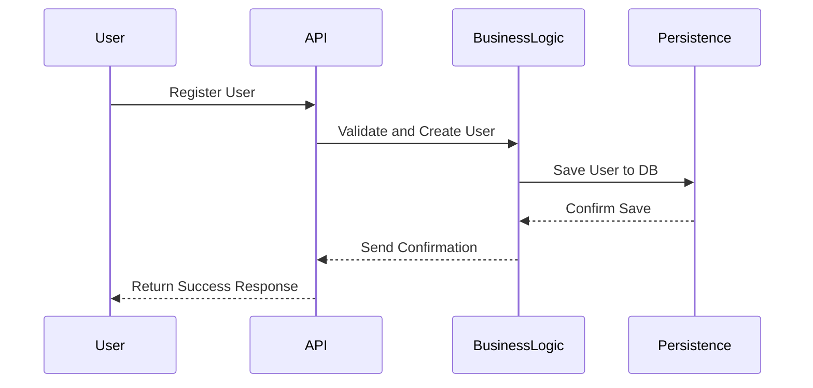
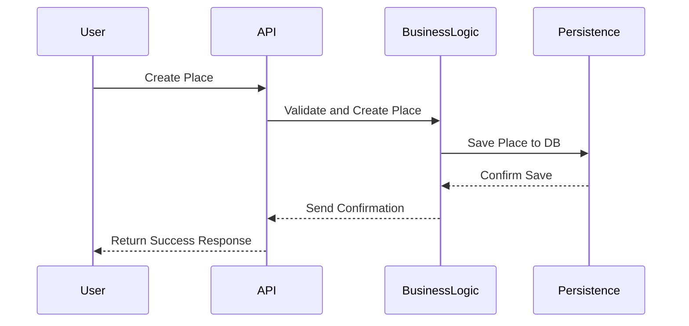
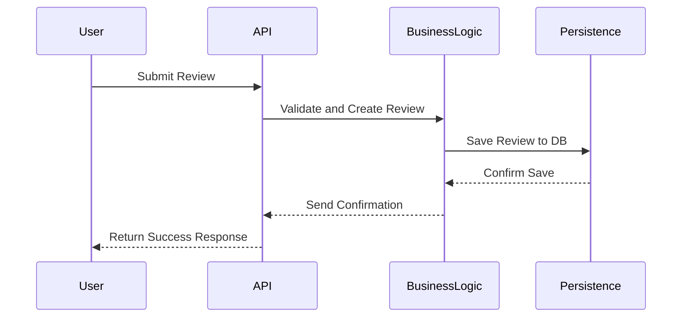
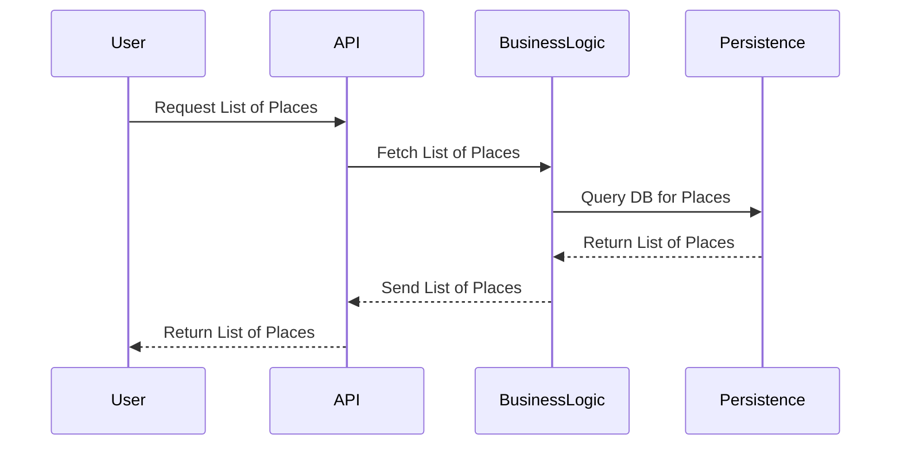

# **HBnB Project Technical Documentation**

## **Introduction**

This document provides a comprehensive technical blueprint for the development of the HBnB application. It outlines the system’s architecture and design, detailing the interaction between different layers and components. The document serves as a reference for developers and stakeholders throughout the implementation phases of the project. It includes high-level architecture diagrams, detailed class diagrams for the business logic layer, and sequence diagrams for key API interactions.

### **Project Overview**

The HBnB application is designed to facilitate property listings, user reviews, and amenity management. The system follows a three-layer architecture: Presentation, Business Logic, and Persistence layers, with interactions managed via a facade pattern. This document will serve as a guide for understanding the system’s design and how each component interacts to provide core functionality.

## **High-Level Architecture**

### **High-Level Package Diagram**

### Explanatory Notes:

- **Purpose**: This diagram shows the three-layer architecture of the HBnB application, which is divided into the Presentation, Business Logic, and Persistence layers.
- **Presentation Layer**: Handles the interaction between the user and the application via APIs.
- **Business Logic Layer**: Implements the core functionalities, containing key models (User, Place, Review, Amenity), with a facade to simplify interaction between layers.
- **Persistence Layer**: Manages data storage and retrieval through database operations.

The **facade pattern** is employed to abstract the complexity of the business logic layer, making interactions between layers more streamlined and easier to manage.

## **Business Logic Layer** 

### **Detailed Class Diagram**

### Explanatory Notes:

- **User**: Represents users of the system. Attributes include id, name, and email, with methods for creating and updating users.
- **Place**: Represents a property listing. Attributes include id, name, and location, with methods for creating and updating a place.
- **Review**: Captures user feedback on a place. Attributes include id, text, and rating, with methods for creating and updating reviews.
- **Amenity**: Represents amenities associated with a place. Attributes include id and name, with methods for creating and updating an amenity.

*The relationships between the entities are*:

- **User-Review**: A user can write reviews for places.
- **Place-Amenity**: A place can have multiple amenities.

## **API Interaction Flow** 

### **Sequence Diagrams**

#### 1. User Registration API Call

### Explanatory Notes:

- The user sends a registration request to the API.
- The API forwards the request to the Business Logic Layer for validation and user creation.
- The Business Logic Layer interacts with the Persistence Layer to save the user in the database.
- A success response is sent back to the user.

#### 2. Place Creation API Call

### Explanatory Notes:
- The user sends a request to create a new place.
- The API passes the request to the Business Logic Layer, which creates the place object.
- The place is saved in the database, and a confirmation is sent back to the user.

#### 3. Review Submission API Call

### Explanatory Notes:
- The user submits a review via the API.
- The Business Logic Layer creates a new review object and saves it to the database.
- A confirmation is sent back to the user.

#### 4. Fetching a List of Places API Call

### Explanatory Notes:
- The user requests a list of places from the API.
- The Business Logic Layer fetches the relevant data from the database.
- The list of places is returned to the user.

## **Conclusion**

This technical document serves as a blueprint for the development of the HBnB application. It outlines the architecture of the system, details the design of the core business logic, and provides insights into the interaction flow between layers. The diagrams included here aim to simplify and clarify the structure and functionality of the HBnB system, providing a comprehensive guide for the project’s implementation phase.
