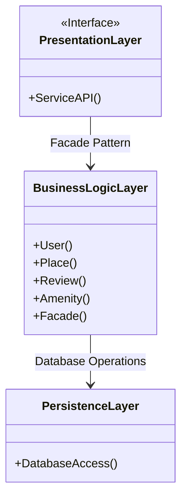

# **HBnB Project Technical Documentation**

## **Introduction**

This document provides a comprehensive technical blueprint for the development of the HBnB application. It outlines the system’s architecture and design, detailing the interaction between different layers and components. The document serves as a reference for developers and stakeholders throughout the implementation phases of the project. It includes high-level architecture diagrams, detailed class diagrams for the business logic layer, and sequence diagrams for key API interactions.

### **Project Overview**

The HBnB application is designed to facilitate property listings, user reviews, and amenity management. The system follows a three-layer architecture: Presentation, Business Logic, and Persistence layers, with interactions managed via a facade pattern. This document will serve as a guide for understanding the system’s design and how each component interacts to provide core functionality.

## **High-Level Architecture**

### **High-Level Package Diagram**

